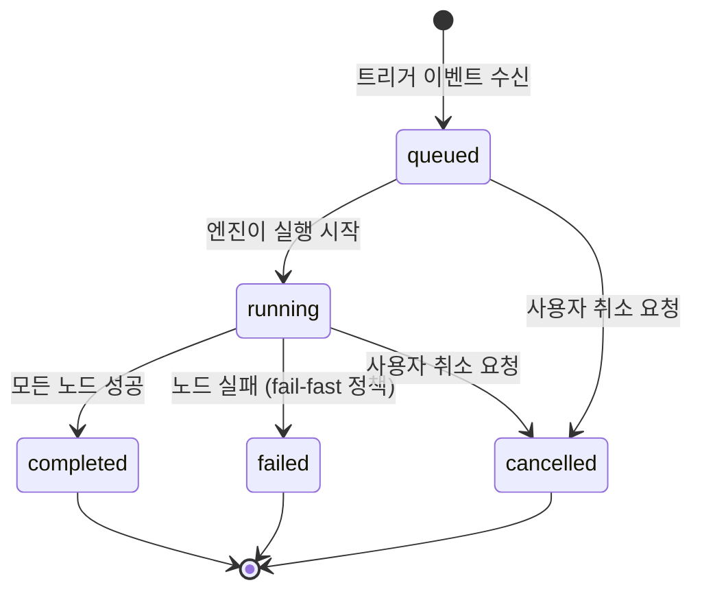
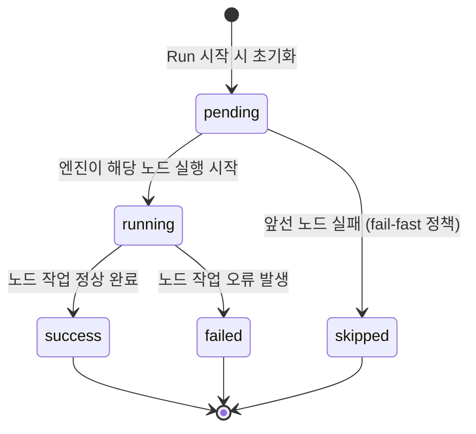

# Workflow 실행 상태 머신 설계

## 1. 개요

Draction의 워크플로 엔진은 노드 그래프를 직렬로 실행한다. 각 워크플로 실행(Run)은 독립적인 생명 주기를 가지며, Run 내부의 각 노드(Node)도 자체 상태 전이를 갖는다. 이 문서는 Run과 Node의 상태 전이를 정의하고, 에러 처리 정책 및 이벤트 소스 경계를 명세한다.

---

## 2. Run 상태 머신

워크플로 실행 단위인 Run의 상태 전이를 정의한다.



| 전이 | 트리거 |
|------|--------|
| `queued` → `running` | 엔진 워커가 큐에서 Run을 꺼내 실행 개시 |
| `queued` → `cancelled` | 사용자 또는 시스템이 실행 전 취소 |
| `running` → `completed` | 그래프의 모든 노드가 `success` 상태로 종료 |
| `running` → `failed` | 임의 노드가 실패하고 fail-fast 정책이 활성화됨 |
| `running` → `cancelled` | 실행 중 사용자 취소 신호 수신 |

---

## 3. Node 상태 머신

Run 내부 각 노드의 상태 전이를 정의한다.



| 전이 | 트리거 |
|------|--------|
| `pending` → `running` | 엔진이 해당 노드를 순차 실행 개시 |
| `running` → `success` | 노드의 핸들러가 오류 없이 반환 |
| `running` → `failed` | 노드 핸들러가 예외를 던지거나 비정상 종료 |
| `pending` → `skipped` | 이전 노드가 `failed`이고 fail-fast 정책 적용 중 |

> **fail-fast 동작**: 하나의 노드가 `failed`로 전이되면, 아직 `pending` 상태인 모든 후속 노드는 실행 없이 즉시 `skipped`로 전이된다. Run 전체는 `failed`로 마킹된다.

---

## 4. 에러 처리 정책

### v0.1 (현재)

- **fail-fast only**: 노드 실패 시 즉시 실행 중단.
- 실패한 노드 이후의 모든 미실행 노드는 `skipped` 처리.
- 재시도 없음. 별도 fallback 노드 없음.

### v0.2 예정

| 기능 | 설명 |
|------|------|
| Per-node retry | 노드별 재시도 횟수 및 백오프 전략 설정 가능 |
| Fallback nodes | 실패 시 대체 노드 실행 경로 정의 가능 |
| Timeout | 노드 및 Run 전체에 타임아웃 설정 가능 |

---

## 5. 이벤트 소스 경계

워크플로 실행을 트리거하는 이벤트 소스의 범위를 정의한다.

### v0.1 (현재)

- **드롭 이벤트만 지원**: Draction 앱 내부에서 발생하는 이벤트(예: 사용자가 파일을 드롭)만 트리거로 사용.
- 외부 파일 시스템 감시 없음.

### v0.2 예정

- **FS Watch 지원**: Inbox 디렉터리를 감시하여 새 파일 도착 시 자동으로 워크플로 트리거.
  - macOS: FSEvents (네이티브 API)
  - 크로스 플랫폼: [chokidar](https://github.com/paulmillr/chokidar)

#### Debounce 전략 (FS 이벤트)

파일 시스템 이벤트는 단일 파일 작업에 대해 복수의 이벤트가 연속 발생할 수 있다. 이를 방지하기 위해 다음 debounce 전략을 적용한다.

```
FS 이벤트 수신
    → debounce 타이머 시작 (예: 300ms)
    → 타이머 내 추가 이벤트 수신 시 타이머 리셋
    → 타이머 만료 시 단일 트리거 이벤트로 합산
    → Run 큐에 삽입
```

- 동일 파일에 대한 중복 트리거 방지를 위해 파일 경로 기준으로 debounce 키 관리.

---

## 6. SQLite 접근 제약

Draction 아키텍처에서 데이터베이스 접근은 다음 규칙을 따른다.

| 주체 | 접근 방식 | 허용 여부 |
|------|-----------|-----------|
| Draction 프로세스 | SQLite 직접 접근 (read/write) | 허용 |
| OpenClaw | REST API를 통한 간접 접근 | 허용 |
| OpenClaw | SQLite 직접 접근 | **금지** |

### 이유

- **SQLite single-writer 제약**: SQLite는 동시 쓰기를 지원하지 않는다. 복수 프로세스가 직접 write를 시도하면 락 충돌 및 데이터 손상이 발생할 수 있다.
- **Write는 Draction 프로세스만 수행**: 모든 데이터 변경은 Draction이 단독으로 처리하며, 외부 클라이언트(OpenClaw 등)는 반드시 Draction이 노출하는 REST API를 통해 요청한다.
- **REST API가 단일 진입점**: API 계층이 동시성 제어 및 유효성 검사를 담당한다.

---

## 7. 미결 사항

미결 사항 및 추가 논의가 필요한 항목은 아래 문서를 참고한다.

→ [open-questions.md](./open-questions.md)
